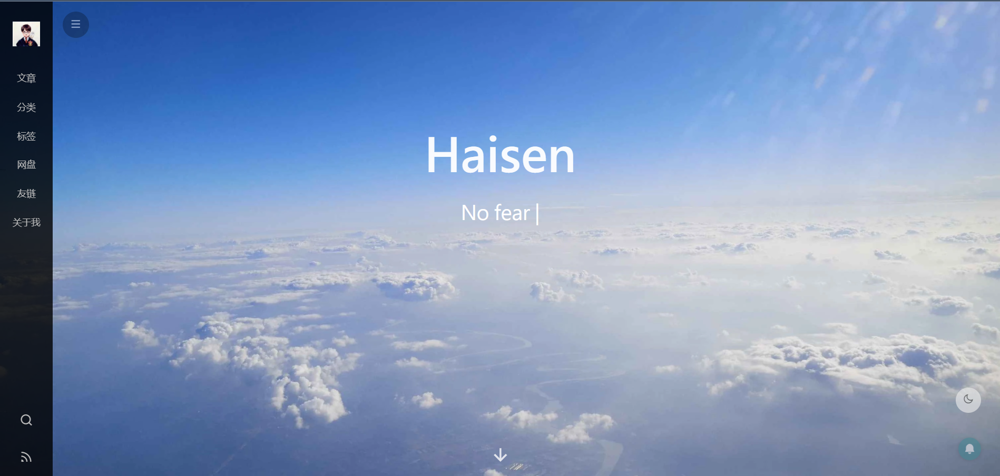

# :blue_book:[GithubPages Mirror][1] #

## :sunny:[Preview][2] ##



----------

## Plugin Configurations ##

```` yml
#Webpushr
webPushNotification:
  webpushrKey:
  webpushrAuthToken:
  trackingCode:

markdown:
  render:
    html: true
    xhtmlOut: false
    breaks: true
    linkify: true
    typographer: false
  plugins:
    - markdown-it-footnote
    - markdown-it-sup
    - markdown-it-sub
    - markdown-it-abbr
    - markdown-it-emoji
  anchors:
    level: 2
    collisionSuffix: 'v'
    permalink: false
    permalinkClass: header-anchor
    permalinkSymbol: ¶

gitalk:
  enable: true # true
  clientID:  # GitHub Application Client ID
  clientSecret:  # Client Secret
  repo: blog-comments # Repository name
  owner: boom1999 # GitHub ID
  admin: boom1999 # GitHub ID
  proxy: 

````

## Thanks ##

### :tada:[Hexo OpenSource][3] ###

### :whale:[shen yu][4] ###

### :speaker:[Webpushr][5] ###

[1]: https://boom1999.github.io
[2]: https://boom1999.github.io
[3]: https://hexo.io/zh-cn
[4]: https://shen-yu.gitee.io
[5]: https://www.webpushr.com
